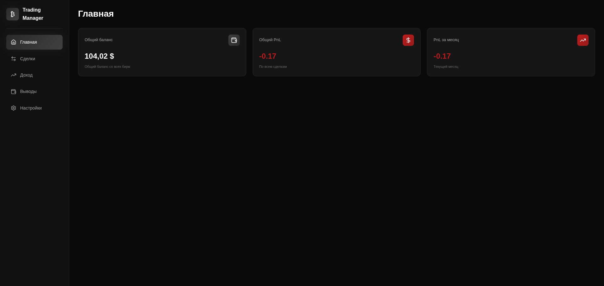
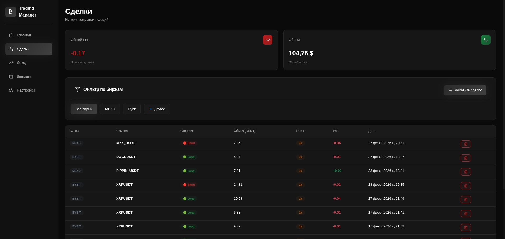
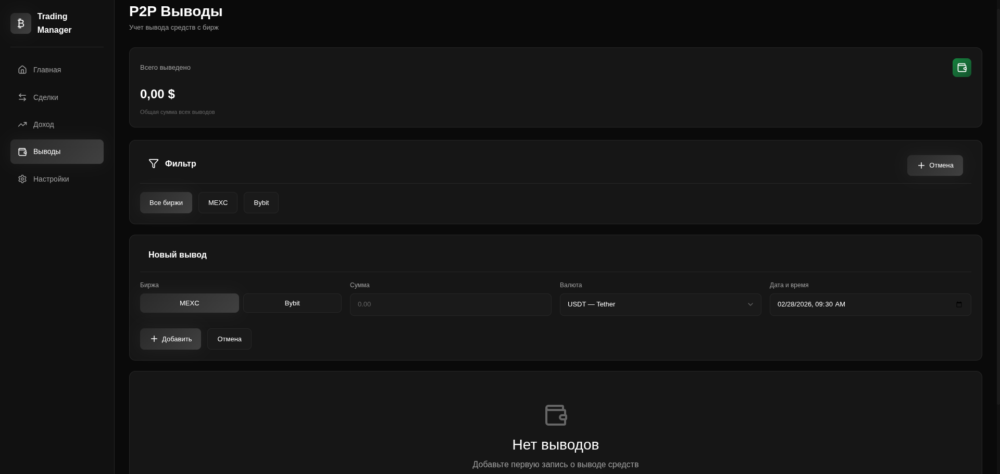
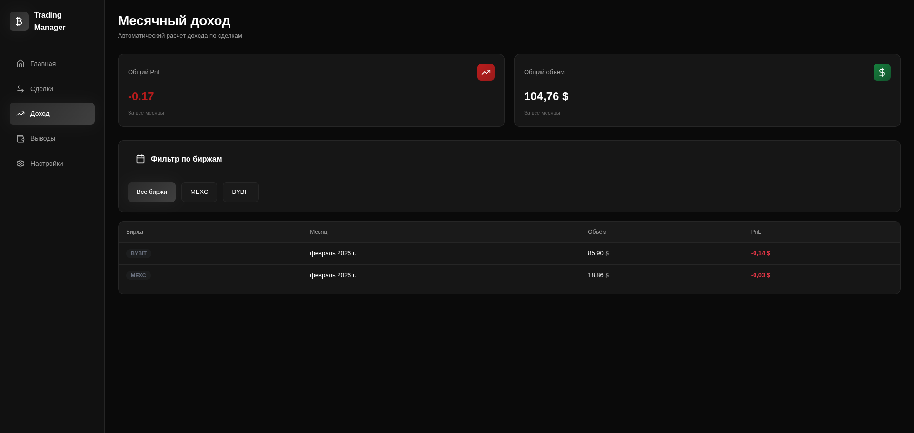
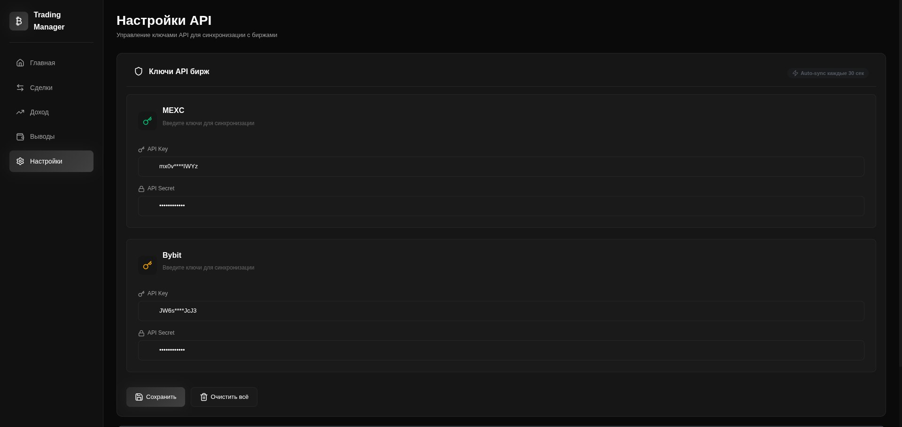
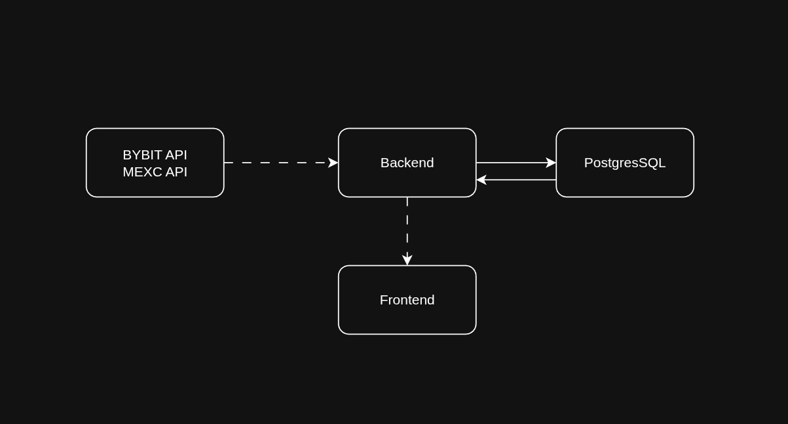

# BudgetTracker 💰

**Cryptocurrency position tracker with automatic synchronization**

## ⚡ Quick Start

### Docker Compose (Recommended)

```bash
# 1. Clone
git clone https://github.com/Ravierin/BudgetTracker.git
cd BudgetTracker

# 2. Create .env and set database password
./setup.sh
# Edit .env and change DB_PASSWORD to your own

# 3. Start (migrations will run automatically!)
docker-compose up -d
```

**Done!** App available at http://localhost:3000

---

## 📸 Screenshots

<table>
<tr>
<td valign="top">
<a href="./docs/screenshots/dashboard.png" target="_blank">

</a>
</td>
<td valign="top">
<a href="./docs/screenshots/position.png" target="_blank">
<br/>
</a>
<a href="./docs/screenshots/withdrawal.png" target="_blank">
<br/>
</a>
<a href="./docs/screenshots/monthly-income.png" target="_blank">
<br/>
</a>
<a href="./docs/screenshots/settings.png" target="_blank">

</a>
</td>
</tr>
</table>

---

## 🚀 Features

- ✅ Auto-sync every 30 seconds
- ✅ Bybit + MEXC support
- ✅ 2 years of position history
- ✅ Total balance across all exchanges
- ✅ PnL analytics
- ✅ Minimalist black-gray UI
- ✅ WebSocket for real-time updates

## 🏗 Architecture



### How It Works:

1. **Initial Sync** — loads entire position history on first startup (up to 2 years)
2. **Auto Sync** — updates data from exchanges every 30 seconds
3. **Database** — all positions stored in PostgreSQL
4. **Frontend** — receives data from DB via REST API
5. **WebSocket** — real-time updates during synchronization

### Bybit Sync:

- Uses `/v5/position/get-closed-positions` endpoint
- Pagination: 7 days per request, up to 2 years of history
- Falls back to execution history if no positions

### MEXC Sync:

- Uses `/api/v1/private/position/list/history_positions`
- Up to 1000 latest positions
- Contract multiplier: 10x for small-cap tokens

## 🔌 API

### Positions
```
GET  /api/v1/positions              # All positions
GET  /api/v1/positions?exchange=bybit  # Positions by exchange
POST /api/v1/positions              # Add position manually
DELETE /api/v1/positions/:id        # Delete position
```

### Balance
```
GET /api/v1/balance                 # Total balance + by exchanges
```

### Monthly Income
```
GET /api/v1/monthly-income          # PnL by month
GET /api/v1/monthly-income?exchange=bybit  # By exchange
```

### API Keys
```
GET  /api/v1/api-keys               # Get keys
POST /api/v1/api-keys               # Save keys
```

## 🛠 Tech Stack

| Component | Technology |
|-----------|-----------|
| **Backend** | Go 1.24, Gorilla Mux, pgx |
| **Frontend** | React 18, TypeScript, Vite |
| **Database** | PostgreSQL 15 |
| **Deployment** | Docker, Docker Compose |
| **APIs** | Bybit V5, MEXC Futures V1 |

## 📁 Project Structure

```
BudgetTracker/
├── backend/                # Go backend
│   ├── cmd/main.go         # Entry point
│   ├── internal/           # Handlers, models, services, repository
│   ├── pkg/                # Config, database, websocket, server
│   ├── api/                # API clients (Bybit, MEXC)
│   └── migrations/         # SQL migrations
│
└── frontend/               # React + TypeScript
    └── src/
        ├── api/            # API client
        ├── components/     # UI components
        ├── pages/          # Dashboard, Positions, Withdrawals, etc.
        └── types/          # TypeScript types
```

## ⚠️ Important Notes

### API Key Security

- 🔑 Keys stored **only in DB** (not in .env)
- 🔒 Use **Read-Only** permissions for API keys
- 🔐 Keys are masked in API responses

### Performance

- 🚀 Initial Sync: ~1-2 minutes to load 2 years of history
- ⚡ Auto Sync: every 30 seconds (fast, only new data)
- 💾 DB: ~1000 positions = ~1MB

## 📞 Contacts

- GitHub: [@Ravierin](https://github.com/Ravierin)
- Telegram: [@fiend_scissors](https://t.me/fiend_scissors)

---

## 📄 License

MIT License

**BudgetTracker** - keeping it simple 📊

